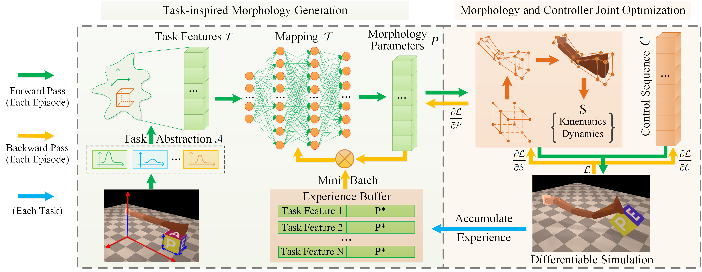

# Task2Morph (IROS2023)

This repository contains the implementation for the paper **Task2Morph: Differentiable Task-inspired Framework**
**for Robot Design** (2023 IEEE/RSJ International Conference on Intelligent Robots and Systems (IROS)). 

Paper: https://arxiv.org/abs/2403.19093

In this paper, we propose a novel and general differentiable task-inspired framework for robot design
called Task2Morph. We abstract task features highly related to task performance and use them to build a task-to-morphology mapping. Further, we embed the mapping into a differentiable robot design process, where the gradient information is leveraged for both the mapping learning and the whole optimization.




Our paper cites **DiffHand**

```
@INPROCEEDINGS{Xu-RSS-21, 
    AUTHOR    = {Jie Xu AND Tao Chen AND Lara Zlokapa AND Michael Foshey AND Wojciech Matusik AND Shinjiro Sueda AND Pulkit Agrawal}, 
    TITLE     = {{An End-to-End Differentiable Framework for Contact-Aware Robot Design}}, 
    BOOKTITLE = {Proceedings of Robotics: Science and Systems}, 
    YEAR      = {2021}, 
    ADDRESS   = {Virtual}, 
    MONTH     = {July}, 
    DOI       = {10.15607/RSS.2021.XVII.008} 
} 
```

## Installation

We provides two methods for installation of the code. **Install on local machine** and **Install by Docker**.

#### Option 1: Install on Local Machine

**Operating System**: tested on Ubuntu 16.04 and Ubuntu 18.04

1. Clone the project from github: `git clone https://github.com/Caiyishuai/Task2Morph.git --recursive `.

2. Install **CMake** >= 3.1.0: [official instruction for cmake installation](https://cmake.org/install/)

3. build conda environment and install simulation

   ```
   cd Task2Morph
   conda env create -f environment.yml
   conda activate task2morph
   cd core
   python setup.py install
   ```

4. Test the installation

   ```
   cd examples
   python test_redmax.py
   ```

   If you see a simulation rendering with a two-link pendulum as below, you have successfully installed the code base.

   [](https://github.com/eanswer/DiffHand/blob/master/demos/test_redmax.gif)

#### Option 2: Install by Docker

We provide a docker installation in the `docker` folder. Follow the readme instruction in `docker` folder to complete the installation.

## Run the Code

#### Run the examples in the paper

We include the three co-design scenario inspired by `DiffHand`  from the paper in the `tak2mroph` folder.

- **Finger Reach**
- **Flip Box**
- **Rotate Plank**

To run our method , you can enter the corresponding folder and run `demo.sh` under the folder. For example, to run **Finger Reach**

```bash
cd tak2mroph/01_finger_reach
bash demo.sh
```

or

```bash
cd task2morph/01_finger_reach
python 03_reach_Task2Morph.py
```

If you want to run the `DiffHand` method

```bash
cd task2morph/01_finger_reach
python 02_reach_DiffHand.py
```

If you want to train a task-to-morphology mapping

```
cd task2morph/01_finger_reach
python 01_reach_train_model.py
```

